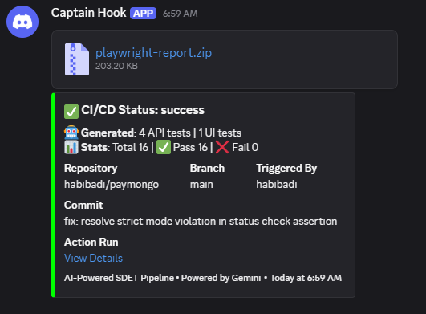

# AI-Driven SDET Test Generation Pipeline (V2) 🚀🛡️

This repository contains an enterprise-grade automated pipeline for **Programmatic LLM-Based Test Generation** and execution. It covers both **API (Rest)** and **E2E (UI)** testing using Gemini AI and Playwright.

---

## 🏛️ Architecture Overview

The system treats AI as a **pipeline component**, not just a manual helper. It follows a **"Detect -> Generate -> Validate -> Heal -> Notify"** workflow.

1.  **Change Detection**: Hashes Swagger/TSX files to only regenerate tests for changed endpoints/pages.
2.  **Context Injection**: Injects clean Swagger snippets (API) or Cleaned HTML DOM (UI) into Gemini Pro.
3.  **Static Guardrails**: 5-layer validation (Imports, Skeleton, Assertions, Integrity, ESLint) to reject malformed AI outputs.
4.  **Self-Healing Loop**: Executes a "Trial Run" locally. If failure occurs, feeds the runtime error + failed code back to Gemini for automatic correction.
5.  **CI Quality Gate**: Orchestrates a 3-container environment (API + UI + Tester) to block PRs with failed generations.

---

## 🧠 LLM Prompt Design

### 1. API Prompt Strategy (Swagger-to-Test)
- **Schema-Aware**: Injects full Swagger `definitions` so the LLM understands `$ref` relationships.
- **Ajv Validation**: Mandates the use of `ajv` for strict schema validation.
- **Business Logic Aware**: Explicitly instructs the AI on the application's "Soft-Fail" design (200 OK with `status: failure`).

### 2. UI/E2E Prompt Strategy (DOM-to-Flow)
- **Cleaned DOM Injection**: Instead of raw HTML, we strip noisy Tailwind/CSS classes, SVGs, and scripts to keep the context window focused on structural elements (`role`, `label`, `name`).
- **Anti-Fragile Selectors**: Forbids XPath and `.nth()`. Mandates `getByRole` and `getByLabel`.
- **Exact Matching**: Enforces `{ exact: true }` for sensitive short fields like CVV and Expiry.

---

## 🩹 Handling AI Failure & Flakiness

### 1. Preventing Hallucinations
- **Guardrail G5 (UI)**: Detects if the AI "invents" button labels (like generic `/submit/i`) that don't exist in the provided DOM snippet.
- **Guardrail G6 (Assertion)**: Detects invalid assertion methods like `.getAttribute()` and enforces web-first `.toHaveAttribute()`.

### 2. Self-Healing Workflow
If a generated test fails its **Trial Run**:
- The error log (e.g., `TimeoutError: waiting for locator...`) is captured.
- A **Healing Prompt** is built containing: `[Failed Code] + [Error Log] + [Fresh DOM]`.
- Gemini reconciles the error against the DOM and outputs a pass-ready version.

### 3. Preventing Flaky UI Tests
- **Web-First Assertions**: Uses `.toBeVisible()` instead of `.locator().count() > 0`.
- **Label-First Strategy**: We modified `page.tsx` to include `htmlFor` and `id` links, ensuring the AI can use `getByLabel` which is significantly more stable than CSS selectors.

---

### 📊 CI/CD Notification Example


The pipeline (`.github/workflows/ai-test-gen.yml`) ensures no broken code reaches production:
1.  **Secret Injection**: `GEMINI_API_KEY` is securely injected from Repository Secrets.
2.  **Atomic Generation**: Runs `npm run generate:all`. If generation fails all retries/models, the pipeline **HARD FAILS**.
3.  **Docker Orchestration**: Spins up `go-api`, `next-ui`, and `playwright-tester`.
4.  **Artifacts**: Produces a full `playwright-report` zip-artifact for every run.
5.  **Discord Bot**: Sends a rich embed summary to Discord including pass/fail stats and download links to reports.

---

## 📈 Scaling to Many Endpoints

To handle hundreds of APIs, we implementation:
- **Intelligent Caching**: Using `api_hashes.json` and `ui_hashes.json`. We only pay the AI token cost for what changed.
- **Multi-Model Priority Fallback**:
  - `gemini-3-pro-preview` (Most capable for complex flows)
  - `gemini-3-flash-preview` (Fast & Cheap fallback)
  - `gemini-flash-latest` (Quota protection)
- **Parallel Generation**: Node.js scripts can be easily extended to parallelize generation across model families.

---

## 🔑 Secret Handling & Setup

### Local Injection
1. Create a `.env` in the root (listed in `.gitignore`):
   ```bash
   GEMINI_API_KEY=your_key_here
   STAGING_BASE_URL=http://localhost:3000
   ```
2. Run `npm install`.

### CI Injection
- Add `GEMINI_API_KEY` to GitHub Repo Secrets.
- The workflow automatically maps it: `env: GEMINI_API_KEY: ${{ secrets.GEMINI_API_KEY }}`.

---

## 🚀 Repro Steps
```bash
# 1. Generate Tests (Detects changes & calls Gemini)
npm run generate:all

# 2. Run Quality Gate (Orchestrated Docker)
docker-compose up --build --exit-code-from tester
```

---
*Developed by Antigravity AI SDET Suite.*
